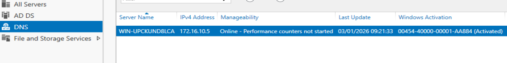
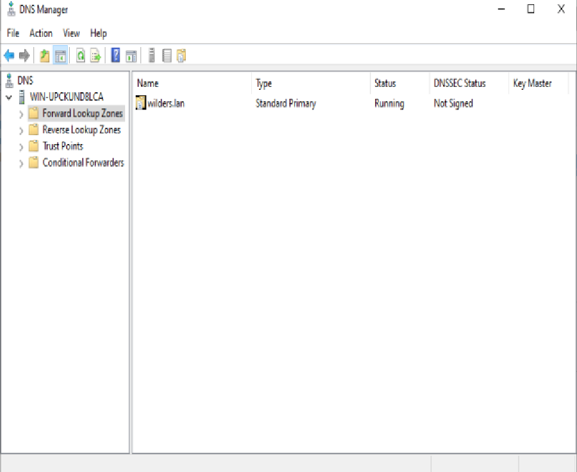
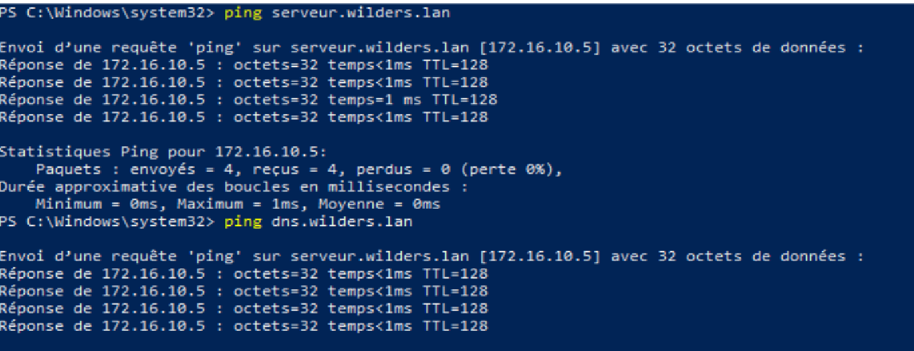
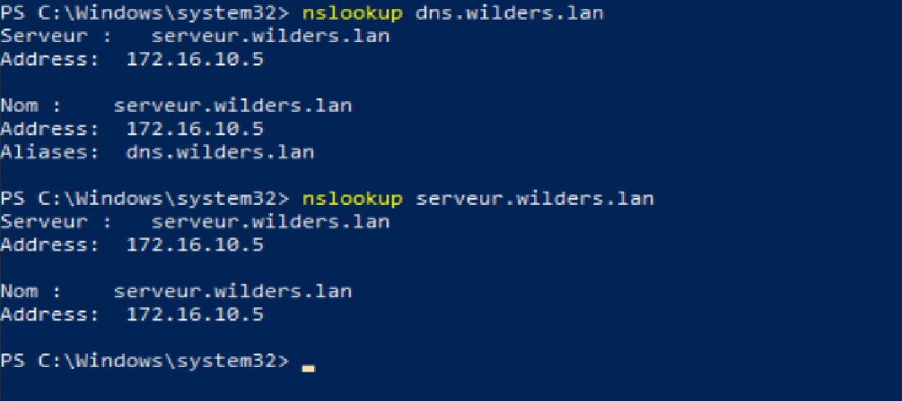

# Atelier-DNS avec Windows Server

- Mettre en place le service DNS 

---
- Forward Lookup Zones Configuration

---
- Reverse Lookup Zones Configuration

---
- Ping depuis le client Win10 vers les 2 noms DNS du serveur

---
- nslookup depuis le client vers le serveur DNS

